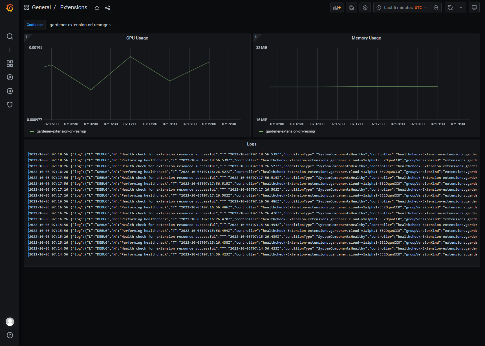
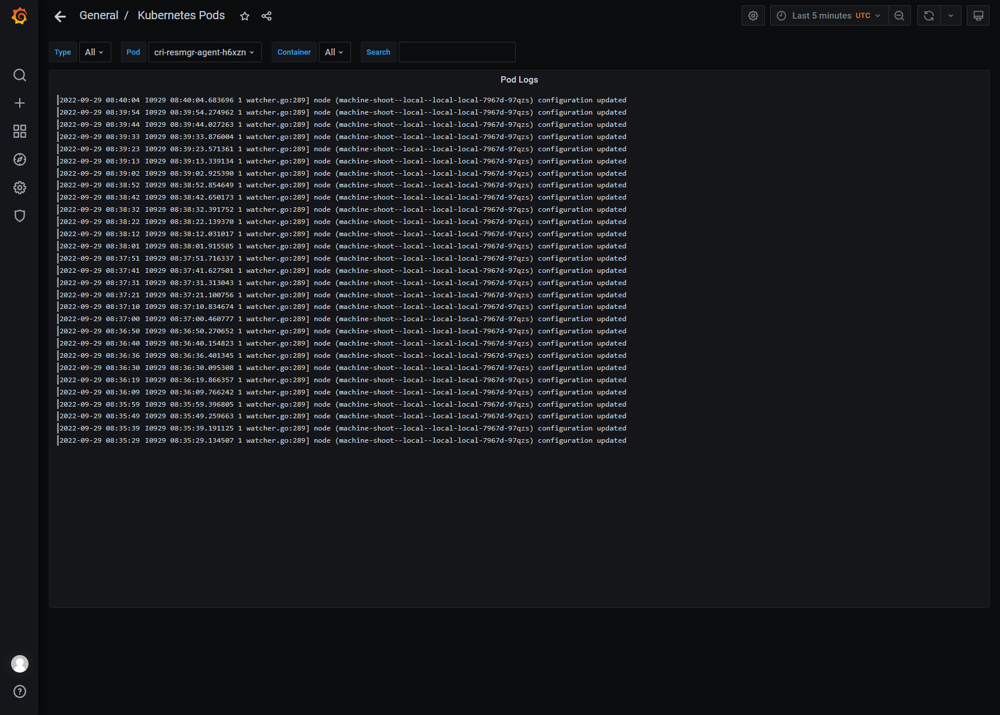
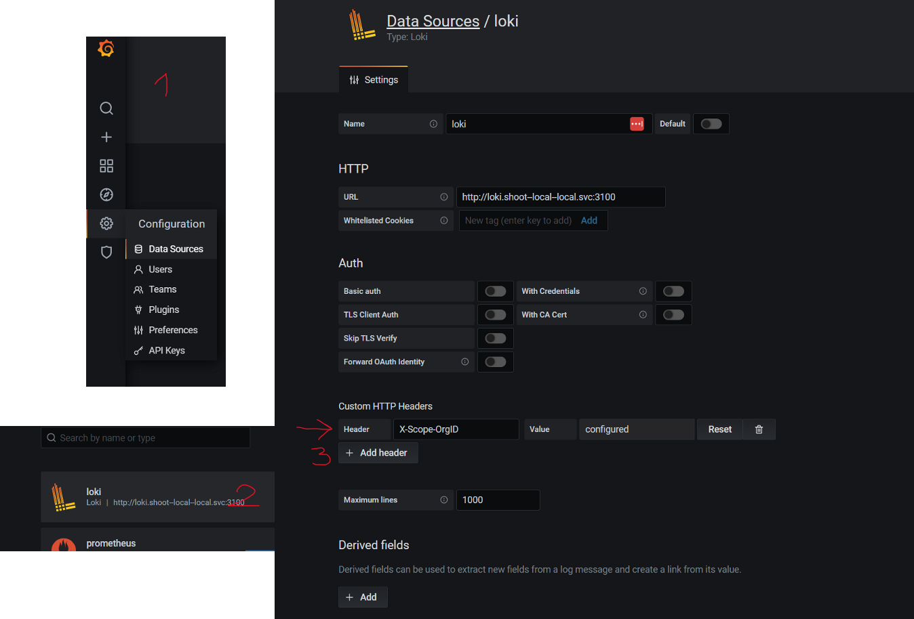

# CRI-Resource-Manager extension for Gardener*


| **Warning** |
| ---------------- |
| Code in **master** branch is "work in progress" and not meant to run in **production** environment! |

### Introduction

Those charts will deploy [CRI-resource-manager](https://github.com/intel/cri-resource-manager) as proxy between kubectl and containerd in "shoot" clusters deployed by Gardener*.

### Description

There are three charts:

- charts/**gardener-extension-cri-resmgr** - used to deploy extension (by deploying "extension" image) in **Seed** cluster - it is not deployed manually but uses `ControllerRegistration` and `ControllerDeployment` manifest in `examples/ctrldeploy-ctrlreg.yaml` which are generated by script `hacks/generate-controller-registration.sh`,
- charts/**cri-resmgr-installation** - internal chart that is included inside "installation" image and used to install `cri-resource-manager` binary inside worker nodes in **Shoot** clusters - it is not meant to be run manually but rather deployed by **gardener-extension-cri-resmgr** chart
- charts/**cri-resmgr-installation** - internal chart that is included inside "installation" image and used to remove `cri-resource-manager` binary inside worker nodes in **Shoot** clusters - it is not meant to be run manually but rather deployed by **gardener-extension-cri-resmgr** chart

## Getting started

### I. Deploying to Gardener.

#### Prerequisites

- *kubectl* 1.20+
- working dir for `mkdir ~/work`
- *gardener-extension-cri-resmgr* is cloned to ~/work path like this:
    ```
    git clone https://github.com/intel/gardener-extension-cri-resmgr ~/work/gardener-extension-cri-resmgr
    ```

#### 1. Build and publish docker images.

```
make docker-images
make publish-docker-images
```

**Note** By default the "private" v2.isvimgreg.com registry is set and used. If you want to use other registry, please modify this files to point to other registry: 

For example: if you want use **registry-example.com** as registry:

* ``charts/cri-resmgr-installation/templates/daemonset.yaml`` and its **spec.template.spec.containers.image** value to "registry-example.com/gardener-extension-cri-resmgr" 
* ``charts/cri-resmgr-removal/templates/daemonset.yaml`` and its **spec.template.spec.containers.image** value to "registry-example.com/gardener-extension-cri-resmgr" 
* ``charts/gardener-extension-cri-resmgr/values.yaml`` and its **image.repository** value to "registry-example.com/gardener-extension-cri-resmgr"

... and specify REGISTRY env variable when building like this:

```
make REGISTRY=registry-example.com/ docker-images
make REGISTRY=registry-example.com/ publish-docker-images
```
Image vector support will be added soon.

#### 2. Install extension by creating **ControllerRegistration** and **ControllerDeployment** in garden cluster.

```
kubectl apply -f examples/ctrldeploy-ctrlreg.yaml
```

note that extension is *not* enabled globally so you need to include it in shoot spec definition like this:

```yaml
spec:
  extensions:
  - type: cri-resmgr-extension
```

### II. Deploying locally.

This is fully working example that uses local deployed gardener and shoot created in kind cluster.
This is based on https://github.com/gardener/gardener/blob/master/docs/deployment/getting_started_locally.md

#### Prepare local kind-based garden cluster

##### 1. Clone the gardener

```bash
mkdir -p ~/work/
git clone https://github.com/gardener/gardener ~/work/gardener
cd ~/work/gardener
git checkout v1.54.0
```

##### 2. Prepare kind cluster 

```bash
cd ~/work/gardener
make kind-up

kubectl cluster-info --context kind-gardener-local --kubeconfig ~/work/gardener/example/gardener-local/kind/kubeconfig
cp ~/work/gardener/example/gardener-local/kind/kubeconfig ~/work/gardener/example/provider-local/base/kubeconfig
# WARNING!: this overwrites your local kubeconfig
cp ~/work/gardener/example/gardener-local/kind/kubeconfig ~/.kube/config
```

Check that kind cluster is ready:

```bash
kubectl get nodes
```

#####  3. Deploy local gardener

```bash
make gardener-up
```

Check that three gardener charts are installed:

```bash
helm list -n garden
```

#### Deploy cri-resmgr extension

##### 1. (Optional) Regenerate ctrldeploy-ctrlreg.yaml file:

```bash
cd ~/work/gardener-extension-cri-resmgr
./hacks/generate-controller-registration.sh
```

##### 2. Deploy cri-resmgr-extension as Gardener extension using ControllerRegistration/ControllerDeployment

```bash
cd ~/work/gardener-extension-cri-resmgr
kubectl apply -f ./examples/ctrldeploy-ctrlreg.yaml
```

By default generated "ControllerRegistration" is not enabled globally, so you need to include this extension in shoot definition. Check [this shoot.yaml](examples/shoot.yaml) as example.

Checkout installed objects:

```bash
kubectl get controllerregistrations.core.gardener.cloud cri-resmgr-extension
kubectl get controllerdeployments.core.gardener.cloud cri-resmgr-extension
```

There should be 'cri-resmgr-extension   Extension/cri-resmgr-extension' resources visible alongside cri-resmgr-extension deployment.

Remember that "controller installation" should not be yet available - there is not shoot cluster deployed yet and extension is disabled by default.

```bash
kubectl get controllerinstallation.core.gardener.cloud 
```

should no return "cri-resmgr extension" installation.

##### 3. Deploy shoot "local" cluster.

Build an image with extension and upload to local kind cluster

```bash
make docker-images
```

by default ``v2.isvimgreg.com`` registry is used (check 'Build and publish docker images' section for more info)

Deploy those images inside kind cluster (not needed if public registry is used):

```bash
kind load docker-image v2.isvimgreg.com/gardener-extension-cri-resmgr:latest --name gardener-local
kind load docker-image v2.isvimgreg.com/gardener-extension-cri-resmgr-installation:latest --name gardener-local
kind load docker-image ghcr.io/gardener/machine-controller-manager-provider-local/node:latest --name gardener-local
```

or just call
```
./hacks/kind-load-images.sh
```

Create shoot:

```
kubectl apply -f examples/shoot.yaml
```

Check that shoot cluster is ready:

```
kubectl get shoots.core.gardener.cloud -n garden-local --watch -o wide
```

In our shoot example, the extensions is also disabled by default and need to be enabled after shoot is created with following command:

```
kubectl patch shoot local -n garden-local -p '{"spec":{"extensions": [ {"type": "cri-resmgr-extension", "disabled": false} ] } }'
```

##### 4. Verify that ManagedResources are properly installed in shoot 'garden' (seed class) and  'shoot--local--local' namespace

```
kubectl get managedresource -n garden | grep cri-resmgr-extension
kubectl get managedresource -n shoot--local--local | grep extension-runtime-cri-resmgr
```

##### 5. Check shoot cluster node is ready

First get credentials to access shoot cluster:

``` 
kubectl -n garden-local get secret local.kubeconfig -o jsonpath={.data.kubeconfig} | base64 -d > /tmp/kubeconfig-shoot-local.yaml
```

... and check status of the node/pods:

```
kubectl --kubeconfig=/tmp/kubeconfig-shoot-local.yaml get nodes
kubectl --kubeconfig=/tmp/kubeconfig-shoot-local.yaml get pods -A
```

##### 6. Check CRI-resource-manager is installed properly as proxy

```
kubectl exec -n shoot--local--local `kubectl get pod -n shoot--local--local --no-headers G machine-shoot | awk '{print $1}'` -- systemctl status cri-resource-manager kubelet -n 0
```

We should observe that:

1. **cri-resource-manager** is installed as service

```
● cri-resource-manager.service - A CRI proxy with (hardware) resource aware container placement policies.
     Loaded: loaded (/etc/systemd/system/cri-resource-manager.service; enabled; vendor preset: enabled)
     Active: active (running) since Wed 2022-06-29 20:21:33 UTC; 2min 14s ago
       Docs: https://github.com/intel/cri-resource-manager
   Main PID: 10937 (cri-resmgr)
      Tasks: 6 (limit: 69411)
     Memory: 19.5M
     CGroup: /docker/c4cf6958c7757cd0d66aed793a7d19f6364d936a9761c7f49c33894a65caab66/kubelet.slice/kubelet-kubepods.slice/kubelet-kubepods-besteffort.slice/kubelet-kubepods-besteffort-pod9c7ece81_7d98_4884_b214_8f2389308241.slice/cri-containerd-70b98bdb42eec15c4df4cd520d79105b7420f7be4997f4ae8f4b17503d006df4.scope/system.slice/cri-resource-manager.service
             └─10937 /opt/intel/bin/cri-resmgr --fallback-config /etc/cri-resmgr/fallback.cfg
```

2. **kubelet** was reconfigured to use ``cri-resmgr.sock`` as its ``container-runtime-endpoint`` command line option:

```
● kubelet.service - kubelet daemon
     Loaded: loaded (/etc/systemd/system/kubelet.service; enabled; vendor preset: enabled)
     Active: active (running) since Wed 2022-06-29 20:21:39 UTC; 2min 9s ago
       Docs: https://kubernetes.io/docs/admin/kubelet
    Process: 11138 ExecStartPre=/var/lib/kubelet/copy-kubernetes-binary.sh kubelet (code=exited, status=0/SUCCESS)
   Main PID: 11141 (kubelet)
      Tasks: 13 (limit: 69411)
     Memory: 57.1M
     CGroup: /docker/c4cf6958c7757cd0d66aed793a7d19f6364d936a9761c7f49c33894a65caab66/kubelet.slice/kubelet-kubepods.slice/kubelet-kubepods-besteffort.slice/kubelet-kubepods-besteffort-pod9c7ece81_7d98_4884_b214_8f2389308241.slice/cri-containerd-70b98bdb42eec15c4df4cd520d79105b7420f7be4997f4ae8f4b17503d006df4.scope/system.slice/kubelet.service
             └─11141 /opt/bin/kubelet 
             --bootstrap-kubeconfig=/var/lib/kubelet/kubeconfig-bootstrap 
             --config=/var/lib/kubelet/config/kubelet 
             --kubeconfig=/var/lib/kubelet/kubeconfig-real 
             --node-labels=worker.gardener.cloud/kubernetes-version=1.24.0 
             --container-runtime=remote 
             --v=2 
             --container-runtime-endpoint=/var/run/cri-resmgr/cri-resmgr.sock # <---
```

##### 7. Uninstalling (disabling) cri-resource-manager extension

You can disable "cri-resmgr extension" in existing shoot to uninstall cri-resource-manager from shoot worker node like this:

```
kubectl patch shoot local -n garden-local -p '{"spec":{"extensions": [ {"type": "cri-resmgr-extension", "disabled": true} ] } }'
```

now after executing this:

```
kubectl exec -n shoot--local--local `kubectl get pod -n shoot--local--local --no-headers G machine-shoot | awk '{print $1}'` -- systemctl status cri-resource-manager kubelet -n 0
```

there should not be "cri-resource-manager" systemd service unit anymore 

```
Unit cri-resource-manager.service could not be found.
```

... and "kubelet" should connect to containerd.sock as it was by default.

```
● kubelet.service - kubelet daemon
     Loaded: loaded (/etc/systemd/system/kubelet.service; enabled; vendor preset: enabled)
     Active: active (running) since Wed 2022-06-29 20:49:31 UTC; 1min 19s ago
       Docs: https://kubernetes.io/docs/admin/kubelet
    Process: 32351 ExecStartPre=/var/lib/kubelet/copy-kubernetes-binary.sh kubelet (code=exited, status=0/SUCCESS)
   Main PID: 32354 (kubelet)
      Tasks: 12 (limit: 69411)
     Memory: 64.7M
     CGroup: /docker/c4cf6958c7757cd0d66aed793a7d19f6364d936a9761c7f49c33894a65caab66/kubelet.slice/kubelet-kubepods.slice/kubelet-kubepods-besteffort.slice/kubelet-kubepods-besteffort-pod9c7ece81_7d98_4884_b214_8f2389308241.slice/cri-containerd-70b98bdb42eec15c4df4cd520d79105b7420f7be4997f4ae8f4b17503d006df4.scope/system.slice/kubelet.service
             └─32354 /opt/bin/kubelet 
             --bootstrap-kubeconfig=/var/lib/kubelet/kubeconfig-bootstrap 
             --config=/var/lib/kubelet/config/kubelet 
             --kubeconfig=/var/lib/kubelet/kubeconfig-real 
             --node-labels=worker.gardener.cloud/kubernetes-version=1.24.0 
             --container-runtime=remote 
             --v=2 
             --container-runtime-endpoint=unix:///run/containerd/containerd.sock  # <---
```


### III. Running e2e tests

Assuming having gardner cloned in ~/work/gardener

and already set /etc/hosts properly with following entries:
```
127.0.0.1 api.e2e-default.local.external.local.gardener.cloud
127.0.0.1 api.e2e-default.local.internal.local.gardener.cloud
```

then:
```
make -C ~/work/gardener kind-up
cp ~/work/gardener/example/gardener-local/kind/kubeconfig ~/.kube/config
./hacks/kind-load-images.sh
make -C ~/work/gardener gardener-up
kubectl apply -f ./examples/ctrldeploy-ctrlreg.yaml
make e2e-tests KUBECONFIG=$HOME/.kube/config
```

Additional options avaiable provided by test framework:
when running manually with ginkgo:
```
KUBECONFIG=$HOME/.kube/config ginkgo -v --progress --label-filter enable ./test/e2e/... -- -verbose debug -disable-dump -project-namespace testbroken
```

```
  -disable-dump
        Disable the state dump if a test fails
  -existing-shoot-name string
        Name of an existing shoot to use instead of creating a new one.
  -kubecfg string
        the path to the kubeconfig  of the garden cluster that will be used for integration tests
  -project-namespace string
        specify the gardener project namespace to run tests
  -skip-accessing-shoot
        if set to true then the test does not try to access the shoot via its kubeconfig
  -verbose string
        verbosity level (defaults to info)
```

access to e2e shoot with k9s example:

```
k9s --kubeconfig <(kubectl view-secret -n garden-local e2e-default.kubeconfig kubeconfig)
```

### III. Troubleshooting

#### Logging

Logs could be watched from containers, but easily it is from one point - Grafana. Logs for exentsion are avialable in grafana. Logs for cri-resmeg-installation, cri-resmeg-agent and cri-resource-manager in grafana seed.

##### cri-extension
You can check the logs in Grafana - svc/grafana namespace garden.

{container_name="gardener-extension-cri-resmgr"}



##### cri-rm-installation and agent
You can check the logs in Grafana - svc/grafana-operators in seed namespace.

{pod_name="cri-resmgr-installation-XXXXX"} 

{pod_name="cri-resmgr-agent-XXXXX"} 

installation


Agent



##### cri-resource-manager 
You can check the logs in Grafana - svc/grafana-operators in seed namespace.

{node="machine-shoot-xxx",origin="systemd-journal",job="systemd-combine-journal"} |= "cri-resource-manager"


#### Bug in kind local gardener Grafana operator Loki configuration

Login and password are default - admin/admin

And there is a missing configuration in the HTTP header:
> X-Scope-OrgID:operator


